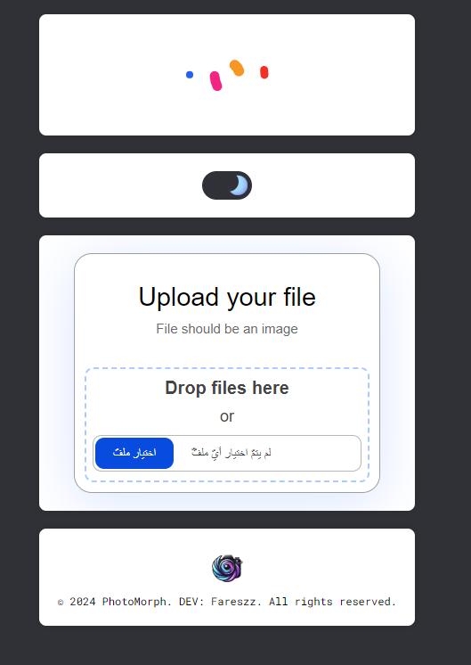
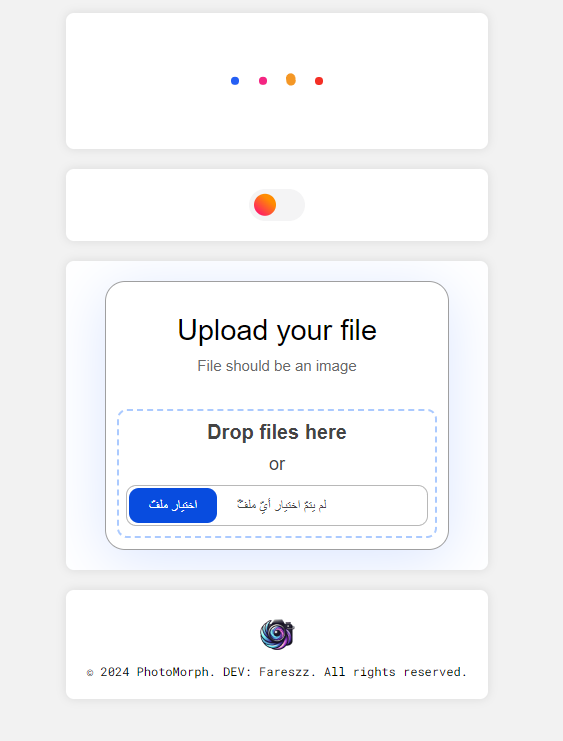

  

  <h3 align="center">PhotoMorph</h3>

  

    "The open-source toolset for cropping, resizing, and converting images to PDFs with ease."
     
    <a href="https://t.me/Fareszz">Telegram</a>
    ·
    <a href="https://github.com/Fareszz1/PhotoMorph/issues">Issues</a>
    ·
    <a href="https://code.visualstudio.com/">VS Code</a>
  

## PhotoMorph

Welcome to PhotoMorph, where you can effortlessly crop and resize images with precision. Transform your pictures into professional PDFs with just a few clicks, ensuring your visual content is perfectly formatted and ready for any purpose.

## Try PhotoMorph
 <a href="https://fareszz1.github.io/PhotoMorph">Click Here</a>

## More Than a PhotoMorph

Here are ten advantages of using your image toolset.

- 🔧 Easy to Use: Intuitive interface for all skill levels.
- ✂️ Precise Cropping: Crop images with accuracy and control.
- 🔍 High-Quality Resizing: Resize images without losing quality.
- 📄 PDF Conversion: Convert images to PDF quickly and efficiently.
- 📏 Customizable Options: Tailor PDF dimensions and orientations.
- 🌟 No Watermarks: Enjoy your images and PDFs without unwanted marks.
- 💨 Fast Processing: Get results in seconds with optimized performance.
- 🔒 Privacy Focused: Your images stay secure and private.
- 📱 Mobile-Friendly: Accessible from any device, anywhere.
- 🛠️ Open-Source: Free and customizable to fit your needs.

### Built With

- [js](https://www.javascript.com/)
- [html](https://html.com/)
- [css](https://www.w3schools.com/css/)

### BY
@fareszz

